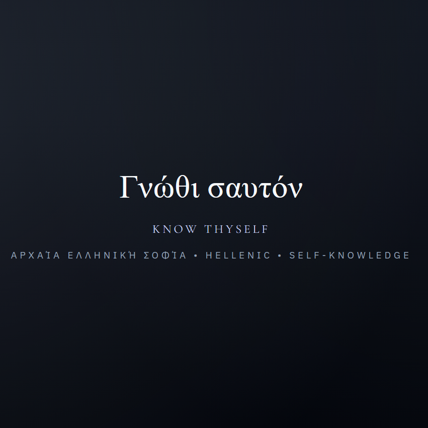

# Sanctum of Wisdom

Sanctum of Wisdom is a contemplative single-page experience that fades timeless wisdom into view, one quote at a time. The collection brings together guiding principles, cultural teachings, and poetic reminders gathered from every corner of the world to inspire reflection in the modern era.



## Live Site
- Explore the production deployment: [quotes.dloizides.com](https://quotes.dloizides.com)

## Features
- 🌍 **Global perspectives** – quotes originate from diverse cultures, languages, and traditions.
- 🧭 **Contextual storytelling** – each quote includes a description, interpretation, and references for deeper exploration.
- 🔄 **Progressive web experience** – offline-ready assets paired with a lightweight service worker.
- ♿ **Accessible typography** – carefully selected pairings for clarity, readability, and atmosphere.

## Data Model
- Quotes are stored in [`quotes-data.js`](quotes-data.js) as an array of richly annotated objects.
- Each entry includes metadata such as culture, category, tags, and a resource list to make further study straightforward.

## Getting Started
1. Install dependencies (only required for development tooling):
   ```bash
   npm install
   ```
2. Launch a local web server (for example with `serve` or `http-server`) and open `index.html` in your browser.
3. Modify `quotes-data.js` to expand the catalog or update metadata.

## Deployment
- The site is optimized for static hosting and can be deployed to any CDN or object storage provider.
- Update [`sitemap.xml`](sitemap.xml) and [`robots.txt`](robots.txt) when publishing to ensure search engines can discover the latest content.

## Contributing
Contributions that expand the list of quotes, improve accessibility, or enhance the contemplative aesthetic are welcome. Please open an issue with your idea or submit a pull request with:

- A clear description of the change.
- Any new references for quotes or cultural context.
- Screenshots if you adjust visual design elements.

## License
This project is licensed under the [MIT License](LICENSE).
