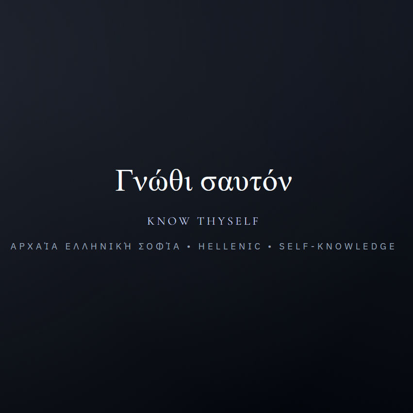

# Sanctum of Wisdom

Sanctum of Wisdom is a contemplative single-page experience that fades timeless wisdom into view, one quote at a time. The collection brings together guiding principles, cultural teachings, and poetic reminders gathered from every corner of the world to inspire reflection in the modern era.



## Live Site
- Explore the production deployment: [quotes.dloizides.com](https://quotes.dloizides.com)

## Features
- 🌍 **Global perspectives** – quotes originate from diverse cultures, languages, and traditions.
- 🧭 **Contextual storytelling** – each quote includes a description, interpretation, and references for deeper exploration.
- 🔄 **Progressive web experience** – offline-ready assets paired with a lightweight service worker.
- ♿ **Accessible typography** – carefully selected pairings for clarity, readability, and atmosphere.

## Data Model
- Quotes are stored in [`quotes-data.js`](quotes-data.js) as `window.QUOTES_DATA`, an array of richly annotated objects.
- Each entry includes metadata such as culture, category, tags, and a resource list to make further study straightforward.
- Entry schema (all fields required):

  | Field | Description |
  |-------|-------------|
  | `id` | Stable string id, contiguous `"1"…"N"`. Assigned on append; never reused. |
  | `quoteText` | The quote in its primary/original language. |
  | `quoteTextEN` | English rendering (equal to `quoteText` for English-language entries). |
  | `quoteDescription` | One-line plain-language gloss / context. |
  | `quoteMeaningAnalysis` | A short, **unique** interpretation (no templated boilerplate). |
  | `author` | Attribution (person, tradition, or `Character (Series)` for anime). |
  | `culture` | Origin bucket, e.g. `Hellenic`, `Chinese (Classical)`, `Japanese (Anime)`. |
  | `category` | Theme, e.g. `Strategy`, `Perseverance`. |
  | `tags` | 3–6 lowercase strings. |
  | `resources` | 1–2 source URLs. |

### Text encoding (important)
`quotes-data.js` is **UTF-8** (no BOM) and contains many non-Latin scripts — Greek
(`ουδέν μονιμότερον τοῦ προσωρινοῦ`), Japanese, Arabic, Hebrew, and more.

If an entry looks garbled — e.g. `ουδέν` instead of `ουδέν`, or `τίποτα`
instead of `τίποτα` — **the file is not corrupted.** That "mojibake" is the signature of a
UTF-8 file being *viewed* as Windows-1252 / Latin-1: each character is a multi-byte UTF-8
sequence (e.g. `ο` = bytes `CE BF`) being decoded one byte at a time. The bytes on disk are
correct; only the viewer's assumed encoding is wrong.

- **Browsers render it correctly** — the site serves `charset=utf-8`, so the live app shows
  proper Greek/Japanese/etc.
- **In an editor:** open/reopen the file as UTF-8 (VS Code: click the encoding indicator in
  the status bar → *Reopen with Encoding* → *UTF-8*).
- **When editing programmatically:** always read and write with `encoding="utf-8"` and, for
  JSON serialization, `ensure_ascii=False` — never re-encode via Latin-1, which would turn
  the correct bytes into genuine double-encoded corruption. Write with `newline="\n"`.

## Getting Started
1. Install dependencies (only required for development tooling):
   ```bash
   npm install
   ```
2. Launch a local web server (for example with `serve` or `http-server`) and open `index.html` in your browser.
3. Modify `quotes-data.js` to expand the catalog or update metadata.

## Deployment
- The site is optimized for static hosting and can be deployed to any CDN or object storage provider.
- Update [`sitemap.xml`](sitemap.xml) and [`robots.txt`](robots.txt) when publishing to ensure search engines can discover the latest content.

## Contributing
Contributions that expand the list of quotes, improve accessibility, or enhance the contemplative aesthetic are welcome. Please open an issue with your idea or submit a pull request with:

- A clear description of the change.
- Any new references for quotes or cultural context.
- Screenshots if you adjust visual design elements.

## License
This project is licensed under the [MIT License](LICENSE).
